<div align="center">

# Hi, I'm Harsh Kumar 👋

### Software Engineering Student · Open-Source Contributor · Developer-Tool Builder

I build practical software with **Go** and **Java**, explore systems and backend engineering,
and contribute focused improvements to open-source projects.

[](https://github.com/harshkumar18-bzz)
[](https://github.com/pulls?q=is%3Apr+author%3Aharshkumar18-bzz)


</div>

---

## About me

- 🔭 Building developer tools, backend systems, and practical desktop applications
- 🌱 Deepening my understanding of networking, APIs, and reliable system design
- 🤝 Interested in useful tools and beginner-friendly open-source collaboration
- ✍️ I value readable code, clear documentation, and software that solves real problems

## Tech stack

<p>
  
  
  
  
  
  
</p>

<p>
  
  
  
  
  
  
</p>

## Developer dashboard

<div align="center">




<br />



<br />
<sub>Charts are generated from public GitHub activity and refreshed automatically each day.</sub>

</div>

## Featured projects

| Project | What it does | Built with |
| --- | --- | --- |
| [**Sonicli**](https://github.com/harshkumar18-bzz/sonicli) | Keyboard-first Spotify client for the terminal, with Spotify Connect and local playback support | Go |
| [**Cache Forward**](https://github.com/harshkumar18-bzz/cache-forward) | Caching proxy CLI with bounded storage, expiry, invalidation, and HIT/MISS diagnostics | Java, Spring Boot |
| [**SecureBank Pro**](https://github.com/harshkumar18-bzz/SecureBank-Pro) | Desktop banking application with authentication, transfers, transaction history, and transactional database operations | Java Swing, MySQL |

## Open-source highlights

| Project | Contribution | Status |
| --- | --- | --- |
| [FOSSASIA / Magic ePaper](https://github.com/fossasia/magic-epaper-app/pull/694) | Improved temporary-image lifecycle handling across Flutter card templates | `Open` |
| [Netty](https://github.com/netty/netty/pull/17645) | Documented pooled allocator internals and chunk-utilization flows | `Open` |
| [Career Ops](https://github.com/career-ops-hq/career-ops/pull/4293) | Updated the README command reference to match the canonical router | `Merged` |

## What I bring to a project

```text
Thoughtful implementation  ·  Clear documentation  ·  Curiosity  ·  Consistent iteration
```

---

<div align="center">

### Let's connect

[GitHub profile](https://github.com/harshkumar18-bzz) · [Pull requests & open-source activity](https://github.com/pulls?q=is%3Apr+author%3Aharshkumar18-bzz)

<sub>Always interested in thoughtful projects, useful tools, and opportunities to learn with other developers.</sub>

</div>
